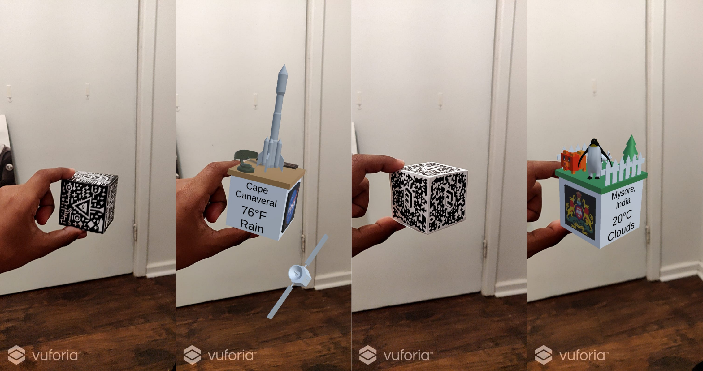

Project 1 - Road to Nowhere
=============================

### Augmented Reality Knickknacks

Introduction
------------

This is an application built with Unity and Vuforia Engine. Pointing your camera at the right cubes turns them into intractable augmented reality knickknacks.

1. The Merge Cube turns into a scene representing Cape Canaveral, Florida.

2. The Class Cube turns into a scene representing Mysore, a city in India, where there is a large zoo.

Video
------
Video to come here!

Description 
------------

### How to use the app

### How to build from the source on GitHub

Dependencies include Unity `Version 2019.4.28f1` and Vuforia `Version 9.8`.

## Assets and sources

Image credits for the representative image:

1. Saturn V rocket, Cape Canaveral, October 1980 (https://commons.wikimedia.org/wiki/File:Saturn_V_rocket,_Cape_Canaveral,_October_1980.jpg)

2. Tiger at Mysore Zoo (https://commons.wikimedia.org/wiki/File:Tiger_at_Mysore_Zoo.jpg)

### Merge Cube

#### Models Created by Me

#### Models Used from the Web

### Class Cube

#### Models Created by Me

#### Models Used from the Web

## Explanations

### How is the model and its various assets representative of that location?

### Custom Magic-8-ball its working and its responses:

Discussion
----------

### Will things like this become popular in several years when AR eye-wear  becomes ubiquitous? And what kinds of small physical objects would benefit from being enhanced by AR?

1. Novelty Items - Whose value is mainly in their novelty. Trinkets etc.
2. Representative Place Holders - Items that are used to represent something. In the sense that their value is in the information that they provide
3. Information Localization - Information about an object should be available as close to the object as possible. Signboards next to zoo exhibits would be useless if they were in some other location far away from the exhibit. 
