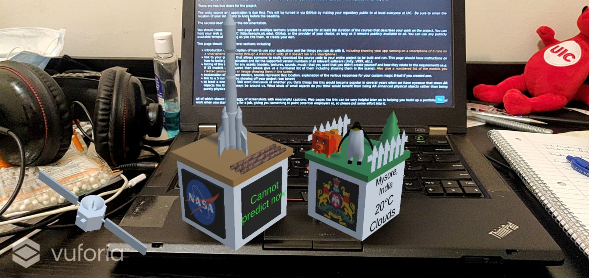

Project 1 - Road to Nowhere
=============================

### Augmented Reality Knickknacks

Introduction
------------

This is an application built with Unity and Vuforia Engine. Pointing your camera at the right cubes turns them into intractable augmented reality knickknacks.

1. The Merge Cube turns into a scene representing Cape Canaveral, Florida. It shows the current weather there in Fahrenheit, and also functions as a magic eight ball.

2. The Class Cube turns into a scene representing Mysore, a city in India, where there is a large zoo. It shows the current weather there in Celcius, and also functions as a magic eight ball.

Video
------

Video to come here!

Description 
------------

Cape Canaveral is the primary launch base where NASA has launched some of its most historic rockets.

Mysore is the cultural capital of Karnataka. A very old and beautiful city. It has a big zoo where thousands of animals are exhibited

### How to use the app

1. Open the app and point the camera at the right cube.

2. If you've selected the ground plane scene, then you'll need to tap on the screen and it will place a large knickknack on the floor seen your image.

### How to build from the source on GitHub

Dependencies include Unity `Version 2019.4.28f1` and Vuforia `Version 9.8`.

1. Clone the Git Repo
2. Open Unity Hub and add this project
3. Add your Vuforia License into the project
4. Go to build settings and select the appropriate scene that you want.
5. Build the `apk` and install it in your Android phone

## Assets and sources

Image credits for the poster image:

1. Saturn V rocket, Cape Canaveral, October 1980 (https://commons.wikimedia.org/wiki/File:Saturn_V_rocket,_Cape_Canaveral,_October_1980.jpg)

2. Tiger at Mysore Zoo (https://commons.wikimedia.org/wiki/File:Tiger_at_Mysore_Zoo.jpg)

### Merge Cube (Cape Canaveral)

Nasa Emblem: https://en.wikipedia.org/wiki/File:NASA_logo.svg

#### Sounds Used in the NASA knickknack:

1. Mission Crontrol Ambient Music by user ProtoSounds https://freesound.org/people/ProtoSounds/sounds/379269/

2. Apollo and Mercury Sounds & Sound Bites by user DudeAwesome https://freesound.org/people/DudeAwesome/sounds/386070/

3. WINK-01.wav by user newagesoup https://freesound.org/people/newagesoup/sounds/350359/ (Used for the sound that the magic-eight-ball makes when updating text)

#### Models Created by Me

1. Rocket

2. Satellite- This object orbits around the cube.

#### Models Used from the Web

1. Sputnik 1 by Ludashov Anton https://assetstore.unity.com/packages/3d/vehicles/space/3d-model-sputnik-1-192475

2. Pipers by Maksim Bugrimov https://assetstore.unity.com/packages/3d/environments/industrial/pipers-63800

3. Military radar by Yorzh Aleksey https://assetstore.unity.com/packages/3d/environments/military-radar-93579

### Class Cube (Mysore, India)

Ambient Sound:
Jungle by user spiid https://freesound.org/people/spiid/sounds/344204/ 

Karnataka State Emblem: https://upload.wikimedia.org/wikipedia/commons/thumb/a/aa/Seal_of_Karnataka.svg/278px-Seal_of_Karnataka.svg.png

#### Models Created by Me

1. Tree

2. Fences

#### Models Used from the Web

1. Voxel Animals Pack by Total Game Assets https://assetstore.unity.com/packages/3d/characters/animals/voxel-animals-pack-133366

2. White Rabbit by Niwashi Games https://assetstore.unity.com/packages/3d/characters/animals/white-rabbit-138709

3. Imperial Penguin by user Felis Chaus https://assetstore.unity.com/packages/3d/characters/animals/birds/imperial-penguin-100397

## Explanations

### How is the model and its various assets representative of that location?

Cape Canaveral is the primary launch base where NASA has launched some of its most historic rockets. I've used models that are associated with space exploration.

Mysore is the cultural capital of Karnataka. A very old and beautiful city. It has a big zoo where thousands of animals are exhibited. The cube displays a few animals and a fence.

### Custom Magic-8-ball its working and its responses:

Unity provides a Vector3 object which can be used to compute the degree of rotation of an object. We make use of an auxiliary variable which is set to 1 every time the object is tilted below, and when it's tilted back upright the Magic Eight Ball checks for tilt using this variable and says a new random saying.

The custom sayings of Class Cube(Mysore) are slightly more casual and humorous versions of the standard sayings.

Discussion
----------

### Will things like this become popular in several years when AR eye-wear  becomes ubiquitous? And what kinds of small physical objects would benefit from being enhanced by AR?

I believe things like this will become popular. There are many advantages that the virtual objects boast of as opposed to physical objects.

1. Virtual Objects are easy to replicate. Every subsequent copy of a virtual object costs a very tiny fraction of what it costs to make the first one.

2. Virtual Objects can be updates and changed very easily. It's as simple as a software update. With smartphones people have become very used to such software patches delivered periodically. Although this has led to the unpleasant practice of companies launching unfinished software products on the promise that they will be completed in the future via patches and updates, it still has its benefits.

3. Virtual objects are not constrained to the laws of physics. It's easy to make fantastical objects that appear magical.

Slowly we are moving towards making virtual objects feel more and more natural and one day it is a certainty that they will completely replace physical trinkets.

As to the question of what kind of small physical objects would benefit from such an AR enhancement the following points should help. I believe that the items that would _truly_ benefit are of the following three kinds.

1. Novelty Items - Items whose value is mainly in their novelty. (Trinkets, Keychains, etc.) These are items which capture your attention for a short duration but aren't of much interest later. Their utility spikes at an instant and diminishes quickly. Such items can enhance both their magnitude of novelty and the duration of utility by getting enhanced by AR. A trinket that keeps changing captures your attention for a longer duration than a static one.

2. Representative Place Holders - Items that are used to represent something. In the sense that their value is in the information that they provide. Augmented Reality enhancement is really just information refinement. A static image can only provide a limited amount information compared to a dynamic one. Therefor any object which is used as an information source or a representation of some information, benefits from getting enhanced by AR.

3. Information Localization - Information about an object should be available as close to the object as possible. Consider signboards next to zoo exhibits that would become useless if they were put in some other location far away from the exhibit. Things can be enhanced by AR whereby all the related information pertaining to an object can be made visible very close to that object. Such objects would also benefit quite a bit from AR enhancement. Consider a drivers license being viewed through AR eye-wear of a police officer. He needn't have to enter that info into some database in some computer, but he'll see all the necessary info appear right next to the drivers license he is holding.

Thus the future holds a special place for AR enhanced objects, it is very encouraging to endeavors that make these a reality. We are on that path.
