Project 3: Perspective
======================

Introduction
------------

How to build it?
----------------

### Requirements

Unity version 2019.4.28f1 is needed. Unity can be downloaded from <https://unity3d.com/get-unity/download>. I am running this on Linux, and you can download the Unity Hub Appimage for Linux on their website as well, and that will then download all the necessary apps and requirements.

This app is using VRTK 4(<https://www.vrtk.io/>)

This app needs the Oculus Quest 1 or Quest 2 headsets to run. Additionally the user may also run it the simulator in Unity, however this does not provide the full experience.

### Build Instructions

GitHub Link: <https://github.com/AkshayChn/csd428-project-3>

Clone the repository to your computer.

Add this folder in Unity Hub by going to **Projects** and clicking on **ADD** button.

Now open this project and Unity should automatically set up all the requirements and associated libraries.

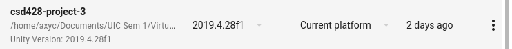

Connect your Quest headset to the computer and make sure you have turned on USB loading in the Developer Options.

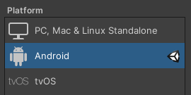

The scenes should already be selected in the following order.

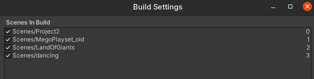

In Unity go to File -> Build Settings and change the build target to Android, by clicking _Switch Platform_.

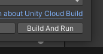

Then Click on _Build and Run_, this asks you where to save the `.apk` file, select a location and continue.

Unity should now build the application and install it on the quest. When Unity shows that the build has been successful, you may unplug the Quest headset, and the app would be running on it.

Note: `CameraRigs.UnityXR` is turned on by default which allows you to run the app on the Quest headsets, however if you want to run it in the simulator then turn it off and turn on the `CameraRigs.SpatialSimulator` in the scene that you are interested in.

While the Simulator is fine to just look around. It is very cumbersome to actually experience all the aspects of the scenes. Using a headset is recommended for the full experience.

The Different Scenes and how to use them
-----------------------------------------

#### 1. Default Scene and the Menu System

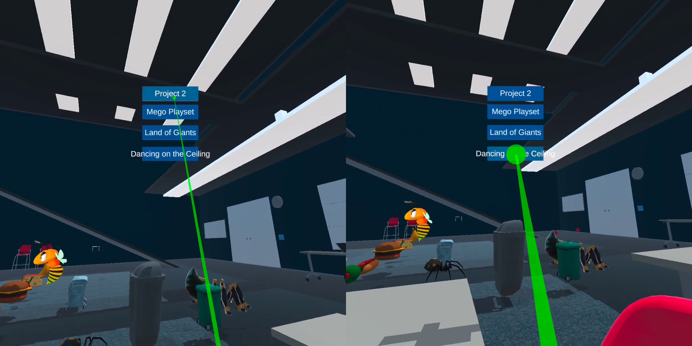

The default scene opens with a Scene Selection Menu that is open by default. This menu can be toggled on or off with the **A** button on the right controller

Then point with the right controller and click the joystick on the right controller to select your desired scene.

#### 2. The Land of the Giants

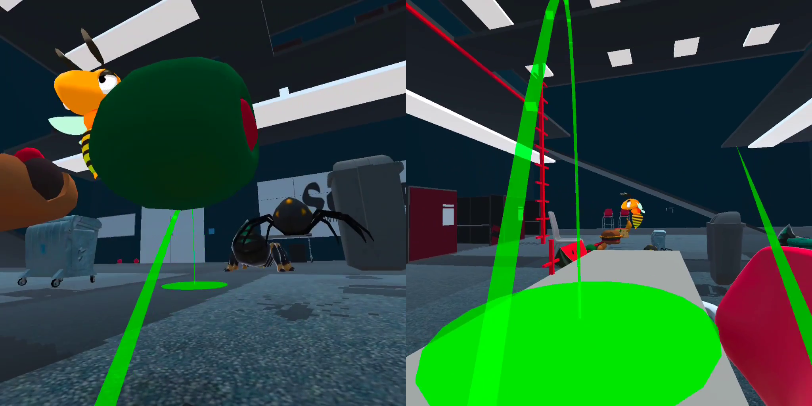

You're a tiny person who is about a foot in height. You start off on a table.

In this perspective all the models appear as giants, and the critters are much more scary.

You can climb back on the table using the ladder.

#### 3. Dancing on the Ceiling

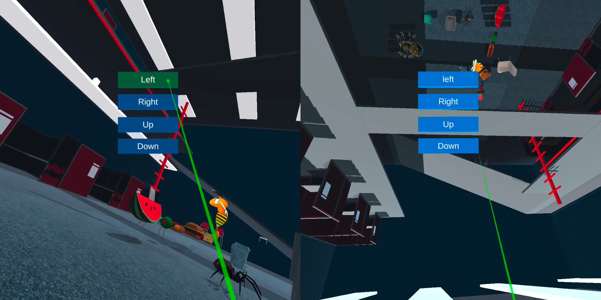

This scene allows you to tilt the room to various angles.

Press the **B** button on the right controller. This will bring up a new menu. You can use the **B** button anytime to toggle this menu on or off. Using it is similar to the Scene Menu.

Clicking the **Left** button tilts the world left on the X-axis by 10 degrees and clicking the **Right** button tilts the world right by 10 degrees.

Clicking the **Down** button flips the world upside down by a 180 degrees.

You can walk on walls or the ceiling by flipping the world.

#### 4. Mego Playset

In this scene the entire room is now the size of a shoebox. This world gives you the perspective of being a giant, and everything that you were afraid of in that room, is now insignificant compared to your stature. 

Models Used from the Web
------------------------

1. Animated Spider by prism bucket Link: https://assetstore.unity.com/packages/3d/characters/animals/insects/animated-spider-22986

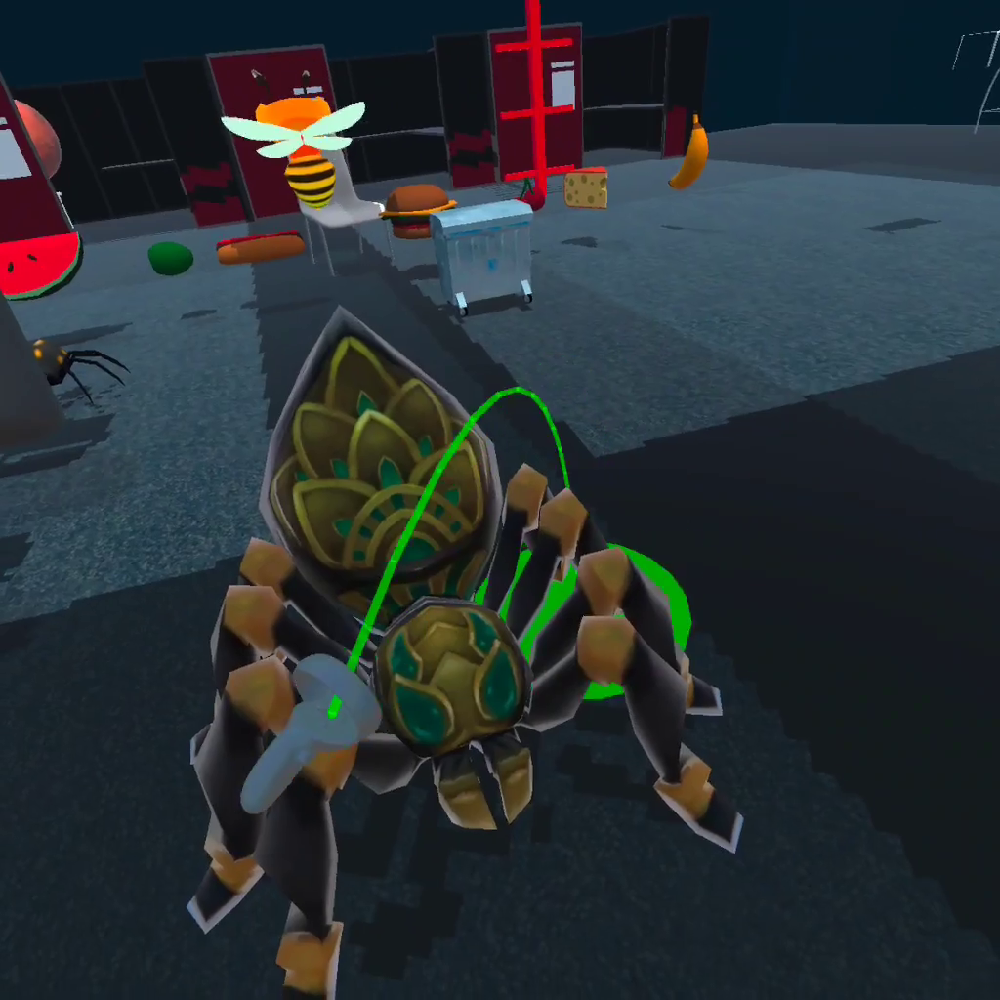

2. Fantasy Bee by amusedART Link: https://assetstore.unity.com/packages/3d/characters/animals/fantasy-bee-135487

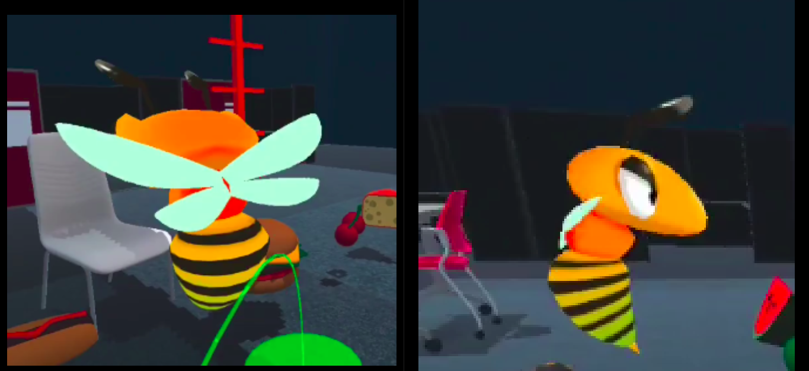

3. Banana: Food Pack - 3D Microgames by Unity Tech Link: https://assetstore.unity.com/packages/3d/food-pack-3d-microgames-add-ons-163295
4. Cheese: Food Pack - 3D Microgames by Unity Tech Link: https://assetstore.unity.com/packages/3d/food-pack-3d-microgames-add-ons-163295
5. Cherry: Food Pack - 3D Microgames by Unity Tech Link: https://assetstore.unity.com/packages/3d/food-pack-3d-microgames-add-ons-163295
6. Hamburger: Food Pack - 3D Microgames by Unity Tech Link: https://assetstore.unity.com/packages/3d/food-pack-3d-microgames-add-ons-163295
7. Hotdog: Food Pack - 3D Microgames by Unity Tech Link: https://assetstore.unity.com/packages/3d/food-pack-3d-microgames-add-ons-163295
8. Olive: Food Pack - 3D Microgames by Unity Tech Link: https://assetstore.unity.com/packages/3d/food-pack-3d-microgames-add-ons-163295
9. Watermelon: Food Pack - 3D Microgames by Unity Tech Link: https://assetstore.unity.com/packages/3d/food-pack-3d-microgames-add-ons-163295

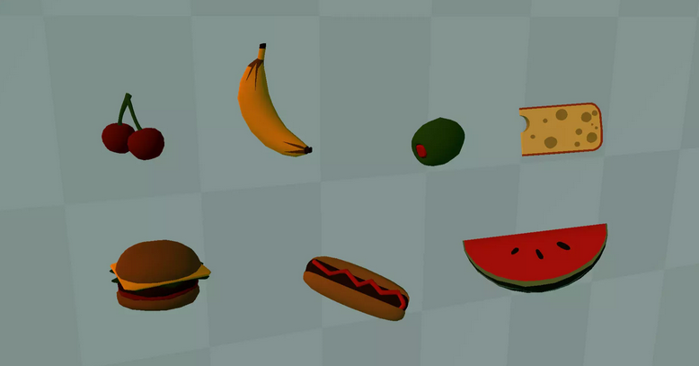

10. Table: Modern Table with Chair by Aquvelous Link: https://assetstore.unity.com/packages/3d/props/interior/modern-table-with-chairs-83834

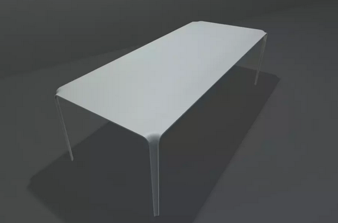

11. Chair: Modern Table with Chair by Aquvelous Link: https://assetstore.unity.com/packages/3d/props/interior/modern-table-with-chairs-83834

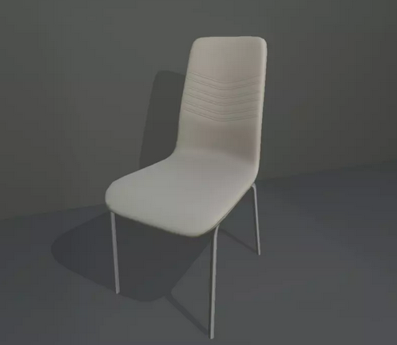

12. Low Poly Trashbin by The Location Lab Link: https://assetstore.unity.com/packages/3d/low-poly-trashbin-60789

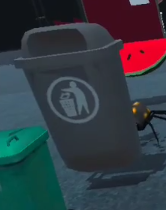

13. Trash Can1: Trash Can by ozgur Link: https://assetstore.unity.com/packages/3d/props/exterior/trash-can-23183
14. Trash Can2: Trash Can by ozgur Link: https://assetstore.unity.com/packages/3d/props/exterior/trash-can-23183

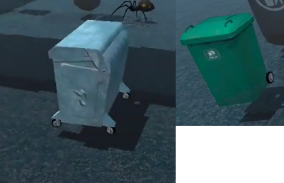

15. Egypt Pack - Spider Demo by Openlab Link: https://assetstore.unity.com/packages/3d/characters/animals/insects/egypt-pack-spider-demo-165807

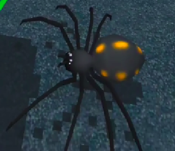

Video
-----
Video can be found at <https://www.youtube.com/watch?v=IpevtdwvZZg>

<iframe width="560" height="315" src="https://www.youtube.com/embed/IpevtdwvZZg" title="YouTube video player" frameborder="0" allow="accelerometer; autoplay; clipboard-write; encrypted-media; gyroscope; picture-in-picture" allowfullscreen></iframe>

Discussion: The different perspectives
--------------------------------------
### Internal mental view of the scene and all its parts

The Ames Room Illusion(<https://en.wikipedia.org/wiki/Ames_room>) as seen below is a famous example of how we perceive things.

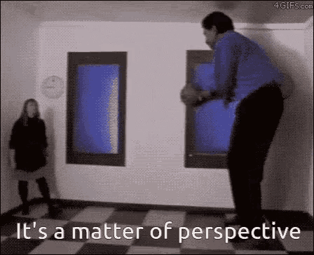

Our perspective of the world is entirely dependent on the stimulus received by our senses. By changing the relative sizes of things, our brain comes up with interpretations of what it sees, and then, it selects the one which seems to be the most plausible. In the Ames Room Illusion, it is far more plausible according to our brain's visual processing system, that the human is tiny, rather than the room being distorted.

In my _Dancing on the Ceiling_ Scene, as the floor below us shifts when the room turns, we feel a loss of balance, even though we may be sitting safely on a chair in the real world. This is because our internal mental image of the world depends a lot on our vision. And when it shifts, we feel as though we are very strongly affected by it. In the _Mego Playset_ version, we feel as though the room is a plaything, and nothing that is dangerous.

The philosopher [George Berkeley](https://en.wikipedia.org/wiki/George_Berkeley) is famous for his theory of Subjective Idealism. Wherein he argues that the world as seen by us only really exists in our mind. That is we aren't aware of the world as it is, but rather we are only aware of the image of the world that our mind recreates from our senses. The very natural implication of this is that as long as the subject is concerned, a virtually created world is just as real as the real world.

On a related note there is a famous thought experiment in philosophy called the ["Brain in a vat"](https://en.wikipedia.org/wiki/Brain_in_a_vat), where in there is an isolated brain kept alive in a jar, hooked up to a bunch of wires that provide the brain with the right neural impulses so as to make the brain think that it is in the real world. This experiment and its associated discourse is helpful in understanding why it isn't surprising just how much our mental image of the world is influenced by virtual reality experiences.

In conclusion, our mental image of the world is very easily influenced by what we perceive. And this can be used for good.

### Uses in the real world

1. _Therapy_: One very good use of this is in therapy, especially where we are using it to treat phobias. In my scene of spiders and insects, seeing them in various sizes has a stark impact on how we perceive them. Having various perspectives of the tings that we are afraid of helps us understand them better. And a better understanding helps in reducing fear.

2. _Emergency Rescue Training_: The crew on a ship must be well versed in how to behave if the ship is capsizing or sinking. The orientation of the ship may change and the floor is no longer below your feet. By practicing in environments like in the _Dancing on the ceiling_ scene, a crew may become more experienced with such scenarios, and potentially save lives.

3. _Land Use Planning_: With our growing need for resources, we are very haphazardly building and settling in places without forethought. The recent heavy rains in the city of Bangalore, India are indicative of this problem. News article [here](https://www.deccanherald.com/city/top-bengaluru-stories/heavy-rains-return-after-a-lull-flood-parts-of-north-bengaluru-1053250.html). The recently developed parts of the city have been built on places which serve as flood plains in times of very heavy rainfall once every decade or two. Problems such as this would have been easily mitigated had someone seen the relief features of the geography at a smaller scale, and immediately recognizing the low lying areas.

4. _Architectural Design_: When designing places of habitation it is very important to experience these places in their true scale. Small models do not do justice. Thus Virtual Reality can help in providing various perspectives at various scales.

5. _Animal Behavior Studies_: Animals, especially the small ones, exhibit peculiar behavior at times that only makes sense at their scale. Tiny insects can drown in the dew drops formed on leaves of plants. Mosquitoes seem to be fairly resistant to rain([Video](https://www.youtube.com/watch?v=XWyoy44oV3Q)). A warthog hides safely in an otherwise dangerously accessible hole([Video](https://www.youtube.com/watch?v=atscgwWdX6Q)). Behavior such as these and many other counter intuitive ones can be better understood if we can experience the world in the same scale and perspective as them.

 

