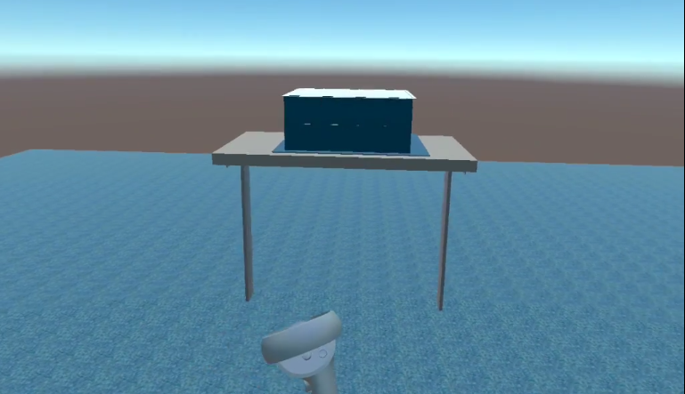

Project 3: Perspective
======================

Introduction
------------

How to build it?
----------------

### Requirements

Unity version 2019.4.28f1 is needed. Unity can be downloaded from <https://unity3d.com/get-unity/download>. I am running this on Linux, and you can download the Unity Hub Appimage for Linux on their website as well, and that will then download all the necessary apps and requirements.

This app is using VRTK 4(<https://www.vrtk.io/>)

This app needs the Oculus Quest 1 or Quest 2 headsets to run. Additionally the user may also run it the simulator in Unity, however this does not provide the full experience.

### Build Instructions

GitHub Link: <https://github.com/AkshayChn/csd428-project-3>

Clone the repository to your computer.

Add this folder in Unity Hub by going to **Projects** and clicking on **ADD** button.

Now open this project and Unity should automatically set up all the requirements and associated libraries.

Connect your Quest headset to the computer and make sure you have turned on USB loading in the Developer Options.

The scenes should already be selected in the following order.

In Unity go to File -> Build Settings and change the build target to Android, by clicking _Switch Platform_.

Then Click on _Build and Run_, this asks you where to save the `.apk` file, select a location and continue.

Unity should now build the application and install it on the quest. When Unity shows that the build has been successful, you may unplug the Quest headset, and the app would be running on it.

Note: `CameraRigs.UnityXR` is turned on by default which allows you to run the app on the Quest headsets, however if you want to run it in the simulator then turn it off and turn on the `CameraRigs.SpatialSimulator` in the scene that you are interested in.

While the Simulator is fine to just look around. It is very cumbersome to actually experience all the aspects of the scenes. Using a headset is recommended for the full experience.

The Different Scenes and how to use them
-----------------------------------------

#### 1. Default Scene and the Menu System

The default scene opens with a Scene Selection Menu that is open by default. This menu can be toggled on or off with the **A** button on the right controller

Then point with the right controller and click the joystick on the right controller to select your desired scene.

#### 2. The Land of the Giants

You're a tiny person who is about a foot in height. You start off on a table.

In this perspective all the models appear as giants, and the critters are much more scary.

You can climb back on the table using the ladder.

#### 3. Dancing on the Ceiling

This scene allows you to tilt the room to various angles.

Press the **B** button on the right controller. This will bring up a new menu. You can use the **B** button anytime to toggle this menu on or off. Using it is similar to the Scene Menu.

Clicking the **Left** button tilts the world left on the X-axis by 10 degrees and clicking the **Right** button tilts the world right by 10 degrees.

Clicking the **Down** button flips the world upside down by a 180 degrees.

You can walk on walls or the ceiling by flipping the world.

#### 4. Mego Playset

In this scene the entire room is now the size of a shoebox.

Models Used from the Web
------------------------

1. Animated Spider by prism bucket Link: https://assetstore.unity.com/packages/3d/characters/animals/insects/animated-spider-22986

2. Fantasy Bee by amusedART Link: https://assetstore.unity.com/packages/3d/characters/animals/fantasy-bee-135487

3. Banana: Food Pack - 3D Microgames by Unity Tech Link: https://assetstore.unity.com/packages/3d/food-pack-3d-microgames-add-ons-163295
4. Cheese: Food Pack - 3D Microgames by Unity Tech Link: https://assetstore.unity.com/packages/3d/food-pack-3d-microgames-add-ons-163295
5. Cherry: Food Pack - 3D Microgames by Unity Tech Link: https://assetstore.unity.com/packages/3d/food-pack-3d-microgames-add-ons-163295
6. Hamburger: Food Pack - 3D Microgames by Unity Tech Link: https://assetstore.unity.com/packages/3d/food-pack-3d-microgames-add-ons-163295
7. Hotdog: Food Pack - 3D Microgames by Unity Tech Link: https://assetstore.unity.com/packages/3d/food-pack-3d-microgames-add-ons-163295
8. Olive: Food Pack - 3D Microgames by Unity Tech Link: https://assetstore.unity.com/packages/3d/food-pack-3d-microgames-add-ons-163295
9. Watermelon: Food Pack - 3D Microgames by Unity Tech Link: https://assetstore.unity.com/packages/3d/food-pack-3d-microgames-add-ons-163295

10. Table: Modern Table with Chair by Aquvelous Link: https://assetstore.unity.com/packages/3d/props/interior/modern-table-with-chairs-83834

11. Chair: Modern Table with Chair by Aquvelous Link: https://assetstore.unity.com/packages/3d/props/interior/modern-table-with-chairs-83834

12. Low Poly Trashbin by The Location Lab Link: https://assetstore.unity.com/packages/3d/low-poly-trashbin-60789

13. Trash Can1: Trash Can by ozgur Link: https://assetstore.unity.com/packages/3d/props/exterior/trash-can-23183
14. Trash Can2: Trash Can by ozgur Link: https://assetstore.unity.com/packages/3d/props/exterior/trash-can-23183

15. Egypt Pack - Spider Demo by Openlab Link: https://assetstore.unity.com/packages/3d/characters/animals/insects/egypt-pack-spider-demo-165807

Video
-----
Video can be found at <https://www.youtube.com/watch?v=IpevtdwvZZg>

<iframe width="560" height="315" src="https://www.youtube.com/embed/IpevtdwvZZg" title="YouTube video player" frameborder="0" allow="accelerometer; autoplay; clipboard-write; encrypted-media; gyroscope; picture-in-picture" allowfullscreen></iframe>

Discussion: The different perspectives
--------------------------------------
1. internal mental view of the scene and all its parts. 

The Ames Room Illusion(<https://en.wikipedia.org/wiki/Ames_room>) as seen below is a famous example of how we perceive.

2. Where do you see this being useful in the real world.

