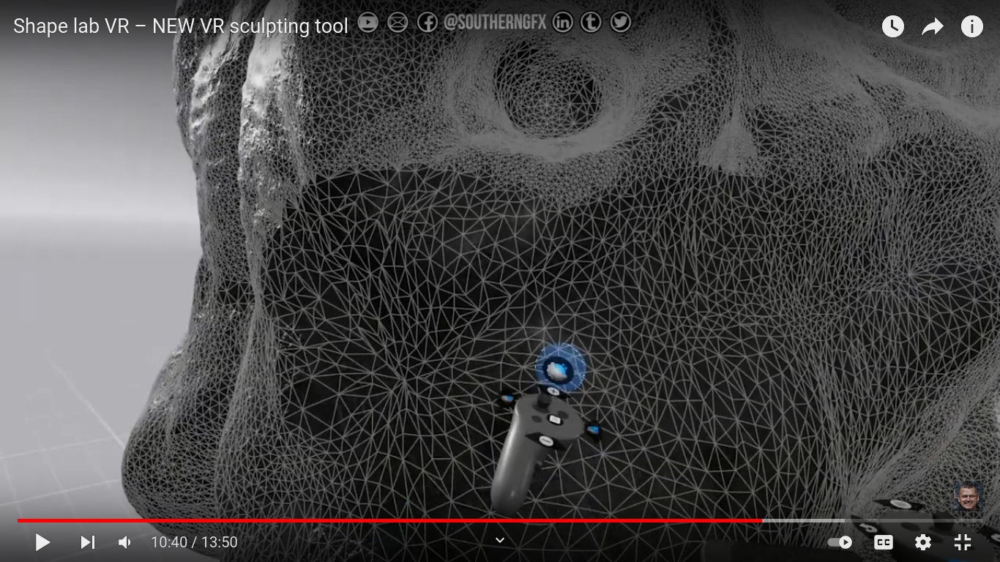
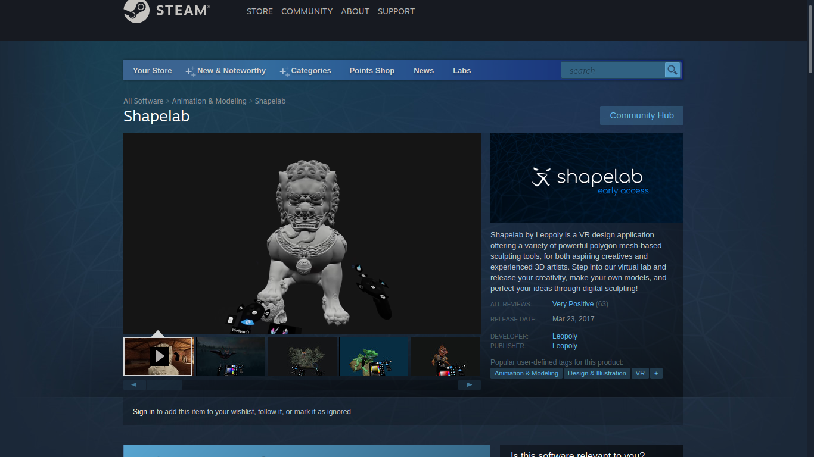
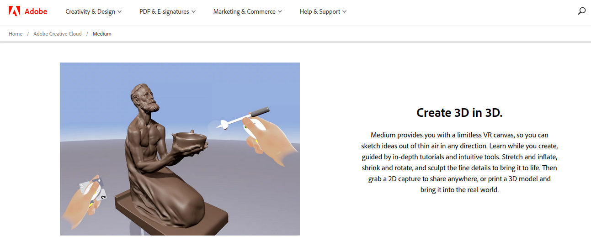
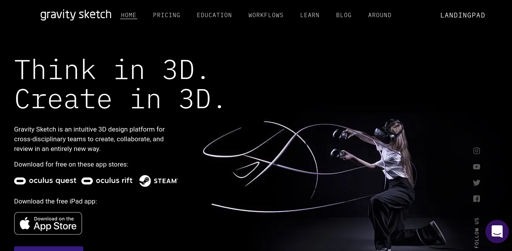

Shapelab VR
===========

[Shapelab VR](https://shapelabvr.com/) is a 3D sculpting application that helps you build 3D models intuitively. It is available on [steam](https://store.steampowered.com/app/571890/Shapelab/). It is especially useful for making objects that aren't very geometric or polygonal, but rather boulbous and freeform. 

Introduction
------------

While apps like Blender also allow one to sculpt like you would with clay, the keyboard and mouse workflow is no match to the intuitive feel of a virtual reality controller.

Glen Southern from the SouthernGFX YouTube channel^[https://www.youtube.com/channel/UC_y11RqmSPmFEXMl6VaWZpA] has two videos reviewing this 3D creation tool. The screencapped images are taken from his video.

Uses polygons instead of voxels.

Who are its intended users?
---------------------------

Available for about $20 on Steam

### Competing Products

1. Adobe Medium^[Adobe Medium]
2. Gravity Sketch

### Hardware Requirements

1. Minimum System Requirements as per Steam: 4th Gen Intel i5 + Nvidia GTX 1060
2. Headsets Supported: Valve Index, HTC Vive, Oculus Rift, Windows Mixed Reality

Why is it a good use of VR or AR?
---------------------------------

Easy and intuitive 3D sculpting.

Blender also has sculpt mode

What are the issues (positive and negative) with it?
-----------------------------------------------------

### Pros:

1. Overall Steam Reviews: Very Positive

2. Very simple to learn.

3. Better definition than voxels.

3. You can dynamically change material as you are sculpting.

4. You can change the lighting and background environment on the fly. This helps in knowing how the object looks in the kind of environment it is intended to be in.

5. Easy switch for Left handed control.

6. You can export to .obj file and you'll retain the model exactly as you had made it.

### Cons:

1. Early Access: This product has been in, and still is, in early access. It is under constant development. 

2. Multi object support: It is only very recently that Shapelab added multi object support. Until then you could only work on one object where everything needed to be joined. You couldn't have two disjoint objects. Now however with the latest update multi object support has finally come after three years. You may now slice and dice as you please. You can also add, subtract, join, and, append many objects. This being a new feature still has a few bugs that need to be swatted in the upcoming releases. One example is that while sculpting with a symmetry mesh, adding a new object to one side, doesn't automatically and symmetrically add the same on the other side as one would expect it to. Only the sculpting is symmetric not object additions.

3. Tools need refining: Shapelab VR had a major update about two months ago where quite a few features were added. Amongst them were a set of new sculpting tools and brushes. These new tools aren't yet tested fully and the users have complained about them needing to be refined properly in the coming updates.

4. Limited workflow: Shapelab does one thing and it does it well. However the way you do that one thing is also quite straightforward. This means it does not allow for a lot of freedom in experimenting with various other workflows. Here the developers have taken a conservative approach in catering to a workflow that an amateur would easily pick-up but a professional would have a hard time adjusting to if she has already been working in a different way.

5. Lack of integration into a larger ecosystem: Adobe Medium comes as a product that integrates tightly with the extensive Adobe ecosystem. Even Gravity Sketch to a large extent has an extended environment such as cloud integration for creators to streamline their workflows. In contrast with them, Shapelab VR is an indie product from a small company which is yet to provide such extensive environment.
