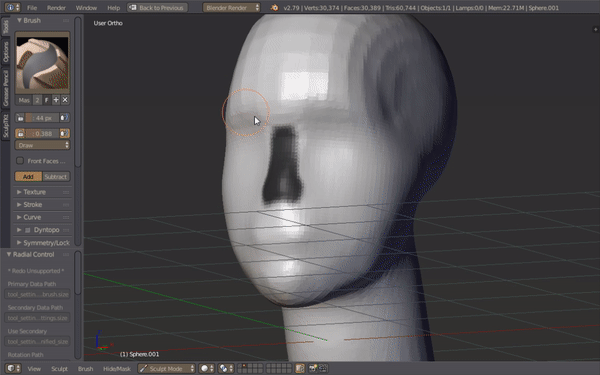

Shapelab VR
===========

[Shapelab VR](https://shapelabvr.com/) is a 3D sculpting application that helps you build 3D models intuitively. It is available on [steam](https://store.steampowered.com/app/571890/Shapelab/). It is especially useful for making objects that aren't very geometric or polygonal, but rather boulbous and freeform. 

Introduction
------------

While apps like Blender also allow one to sculpt like you would with clay, the keyboard and mouse workflow is no match to the intuitive feel of a virtual reality controller.

Glen Southern from the SouthernGFX YouTube channel^[https://www.youtube.com/channel/UC_y11RqmSPmFEXMl6VaWZpA] has two videos reviewing this 3D creation tool. The screencapped images are taken from his video.

##Dynamic Tessellation: Uses polygons instead of voxels.

Who are its intended users?
---------------------------

This product is aimed at the novice creator. It is inexpensive to obtain, easy to use, and, doesn't require complex hardware to run. It is available for about $20 on Steam

### Competing Products

1. Adobe Medium:^[https://www.adobe.com/products/medium.html] This is a virtual reality 3D modeling software from Adobe. This is aimed at professionals and is expensive. It requires some beefy hardware to properly run and isn't suited for novices. It also uses voxels to represent its models. Voxels are (volumetric pixels) where three dimensional objects are represented as collections of blocks. And this representation comes with a host of issues.

2. Gravity Sketch:^[https://www.gravitysketch.com/] This is a free for individuals and expensive for businesses product that is mostly meant for making very polygonal and sharp straight edged models. It uses Subdivision modeling where you cut, slice and join objects to model things.

### Shapelab VR Hardware Requirements

According to Steam the minimum set of hardware that is required is as follows. This makes Shapelab VR fairly easy to run. It also supports a number of virtual reality gear.

1. Minimum System Requirements as per Steam: 4th Gen Intel i5 + Nvidia GTX 1060
2. Headsets Supported: Valve Index, HTC Vive, Oculus Rift, Windows Mixed Reality

Why is it a good use of VR or AR?
---------------------------------

The three dimensional world is best experienced when all the degrees of freedom are available for the user to interact in. 

Shapelab VR offers an easy and intuitive 3D sculpting environment whereby even amateurs can quickly start building models.

Blender also has sculpt mode however using the mouse and keyboard to model in 3D is cumbersome.

What are the issues (positive and negative) with it?
-----------------------------------------------------

### Pros:

1. _Overall Steam reviews are Very Positive_: The product has hit a chord with its users and has catered to a need that was present in the content creation space. The developers are also quick to respond and vigilant enough to take feedback from the community and add features that are most asked for.

2. _Very simple to learn_: This is a product aimed at novices and designed for simplicity. In about an hour all the knobs and switches required for working can be known by the user. This lets anyone get up to speed quickly and start making things of their choice.

3. _Better definition than voxels_: Shapelab VR uses a method called Dynamic Tessellation where in it builds the polygonal geometry of the object as you go on sculpting. It adds and removed triangles dynamically in the background automatically. This means at any given time the object is already in the polygonal representation. The triangle density is controlled automatically as per the detail required. This provides better detail than voxel based representation that is used by products like Adobe Medium.

3. _You can dynamically change material as you are sculpting_: This helps in knowing how the surface texture that you've made looks when the object is of different materials. A recent "paint" mode that was added recently also lets you paint the surface with the colors and textures and of your choice.

4. _You can change the lighting and background environment on the fly_: This helps in knowing how the object looks in the kind of environment it is intended to be in. For a truly "what you see is what you get" experience, you must be "seeing" in the right context as well. Quickly changing the context is very useful when testing things out while making models.

5. _Easy switch for Left handed control_: This is a boon for users who have their left hand as the dominant one. There is a one click switch button in the app settings which flips all the controls to make it easy for them.

6. _You can export to .obj file and you'll retain the model exactly as you had made it_: This is a definite win over voxel based modeling software, which then have to convert the model into a polygonal object. This "what you see is what you get" approach makes it a fantastic tool especially for beginners. 

### Cons:

1. _Early Access_: This product has been in, and still is, in early access. It is under constant development. Features are constantly being added and the users find the product to not be the same as the last time they'd used it. 

2. _Multi object support_: It is only very recently that Shapelab added multi object support. Until then you could only work on one object where everything needed to be joined. You couldn't have two disjoint objects. Now however with the latest update multi object support has finally come after three years. You may now slice and dice as you please. You can also add, subtract, join, and, append many objects. This being a new feature still has a few bugs that need to be swatted in the upcoming releases. One example is that while sculpting with a symmetry mesh, adding a new object to one side, doesn't automatically and symmetrically add the same on the other side as one would expect it to. Only the sculpting is symmetric not object additions.

3. _Tools need refining_: Shapelab VR had a major update about two months ago where quite a few features were added. Amongst them were a set of new sculpting tools and brushes. These new tools aren't yet tested fully and the users have complained about them needing to be refined properly in the coming updates.

4. _Limited workflow_: Shapelab does one thing and it does it well. However the way you do that one thing is also quite straightforward. This means it does not allow for a lot of freedom in experimenting with various other workflows. Here the developers have taken a conservative approach in catering to a workflow that an amateur would easily pick-up but a professional would have a hard time adjusting to if she has already been working in a different way.

5. _Lack of integration into a larger ecosystem_: Adobe Medium comes as a product that integrates tightly with the extensive Adobe ecosystem. Even Gravity Sketch to a large extent has an extended environment such as cloud integration for creators to streamline their workflows. In contrast with them, Shapelab VR is an indie product from a small company which is yet to provide such extensive environment.
